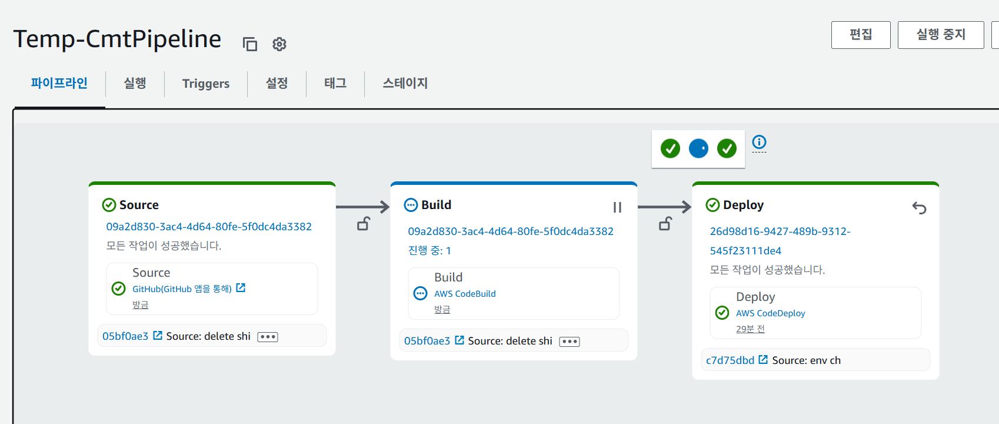

1. # ITWILL 심화반 TEAM POJECT🔜   
       
    Centralized Manufacturing & Tracking   

    연결 - <a href="http://15.165.75.24:8080/login" style="font-weight:bold;cursor:pointer;text-decoration:underline">배포 사이트</a>   

    CMT Co., Ltd.   
    
2. # Tech Stack🔜   
- FRONTEND   
HTML5, CSS3, JAVASCRIPT, JASPER, TOAST UI   

- BACKEND   
JDK : 21 LTS   
Spring Boot : v 3.4.3   
Spring Security : v 6.2.3   
Oracle : Oracle Database 21c Release   
JPA : Hibernate (ORM) 6.4.2.Final   
Thymeleaf : 3.1.3.RELEASE   
MyBatis / Gradle   

- INFRA   
TOMCAT : v 10.1.40   
GitHub - Project   
AWS CI / CD   

- Deploy
AWS EC2 : TOMCAT / ORACLE

    
    
    
    
    
    
    
    
    

3. # Member / Period🔜
    1명 / 2개월(2025.03.05 ~ 2025.05.08)   
    Team프로젝트인 CMT PROJECT(https://github.com/khj20231204/cmtProject) 에서 개선 해야할 부분과 기능을 추가하여 완성한 개인 프로젝트.   

4. # MES🔜
    MES는 Manufacturing Execution System의 약자로, 제조 실행 시스템이라고 번역됩니다. 원자재부터 완제품까지 제조 과정을 실시간으로 모니터링, 추적, 문서화, 제어하는 소프트웨어 시스템입니다. 생산 계획의 실행, 공정 추적, 품질 관리, 작업 지시 관리 등을 지원하여 생산 효율성을 높이고 품질을 향상시키는 데 도움을 줍니다.    

5. # FLOW CHART🔜
    MES 팀프로젝트 전체 순서도   
       

6. # SUBJECT🔜
    __자동차 프레임 생산__ 을 주제로 MES를 구성했습니다.   
    자동차 프레임은 자동차의 구조적 뼈대이며, 차체 조립의 기반이 됩니다. 프레임 공정은 일반적으로 다음과 같은 단계를 포함합니다.   

    1단계 - 압축(PRESS)   
    2단계 - 용접(WELDING)   
    3단계 - 도장(PAINT)   
    4단계 - 조립(ASSEMBLE)   

    이 모든 과정은 높은 정밀도와 추적성이 요구되며, 수많은 부품과 설비가 유기적으로 연결되어 있습니다.  

7. # ROLE PART🔜

    ✅ 수주 / 발주   
    수주 : 다른 회사(고객)로부터 주문을 받아서 계약을 체결하는 것.   
    발주 : 다른 회사에 주문을 내는 것, 우리 프로젝트에서는 생산 제품의 원자재가 부족한 경우에 하는 주문을 발주로 정의.   

    ✅ BOM 기반 작업 흐름   
    자동차 프레임은 다단계 BOM 구조로 이루어져 있으며, MES는 이를 기반으로 하위 부품의 생산 흐름을 제어. 예를 들어, 특정 용접 조립이 선행되어야만 다음 공정이 활성화되도록 설정.   

    ✅ 실시간 LOT 추적   
    MES는 각 프레임 부품의 LOT 번호를 기준으로 이력 추적을 가능. 용접된 부품이 어떤 소재에서 나왔는지, 언제 어떤 설비에서 가공되었는지를 실시간으로 확인할 수 있습니다. 이는 리콜 대응 및 품질 분석에 핵심적인 기능.     

    ✅ 공정 현황 Recod   
    공정이 이루어지는 모든 단계를 기록했다가 재로딩시 이전 상황가 일치하게 로딩되는 페이지 구현.   
    
    
    *로그인/공지사항/작업지시서/LOT추적은 다른 팀원이 함, 사이트 흐름상 가져옴   
       

8. # DETAIL ROLE PART🔍   
   [수주/발주](https://github.com/khj20231204/cmtPersonalProject/wiki/SO_PO)   

   [BOM 기준 정보](https://github.com/khj20231204/cmtPersonalProject/wiki/BOM)

   [LOT](https://github.com/khj20231204/cmtPersonalProject/wiki/LOT)

   [공정](https://github.com/khj20231204/cmtPersonalProject/wiki/PRC)

9.  # GitHub Project🔜
    Main, Develop, pull request, merge   
   
10. # AWS DEPLOY🔜
    EC2에 오라클을 설치 후 DB데이터(테이블, 시퀀스, INDEX, INSERT INTO로 모두 새로 생성)를 복사함 → EC2 프리티어는 21C를 설치하기에 불가능한 환경 → 11g를 설치함 → 로컬에서는 EC2의 오라클(11g)을 연결해서 사용해도 아무 문제가 없는데 배포를 하면 "HTTP 상태  404 – 찾을 수 없음" 또는 "The requested URL was not found on this server" 에러가 뜸
    
    __문제점 1)__ 배포를 한 경우 로딩이 되면 CPU 사용률이 10%를 넘게 되는데 문제는 메모리가 1G밖에 없어서 EC2가 다운 돼버림(20분 마다 한번씩 통신이 끊김) → 해결책) SWAP페이지 생성
    
    여전히 배포한 페이지는 정상 동작이 되지 않음
    
    __문제점 2)__ 보안 정책에 오라클 포트를 추가하지 않았음 -> 해결책) 오라클 포트 1521만 따로 추가해 줌
    
    여전히 배포한 페이지는 정상 동작이 되지 않음
    
    __문제점 3)__ 로컬에서 EC2의 오라클에 접속이 되지 않음 -> 리스너가 실행되지 않은 상태 였음 -> 해결책) sudo su - oracle로 접속해서 sqlplus에서 startup를 한 후 다시 lsnrctl start를 함
    
    여전히 배포한 페이지는 정상 동작이 되지 않음
    
    __문제점 4)__ 하나의 EC2에 배포와 DB접을 동시에 해서 발생하는 문제라고 생각함 -> 해결책)EC2를 새로 하나 만들어 DB접속 EC2와 배포 EC2를 따로 둠
    
    여전히 배포한 페이지는 정상 동작 하지 않음
    
    __문제점 5)__ 21C로 개발한 완성된 프로젝트를 11g로 변경한 경우 다음과 같은 문제점이 발생할 수 있음
    
       (1)JSON 타입 : 21C에서는 JSON 컬럼 지원 - 11g는 없음 → CLOB에 JSON 저장   
       해결책) NOTICE테이블에서 HTML태그가 있는 CONTENT 항목을 하나씩 직접 삽입   
    
       (2)FETCH FIRST n ROWS ONLY 구문은 12C SQL 표준 페이징 - 11g에서는 ROWNUM 방식으로 변경 필요   
       해결책) AttendsMapper.xml, DocumentMapper.xml, WorkOrderMapper.xml에서 FETCH FIRST를 사용하고 있었고 전부 서브쿼리로 변경 후 ROWNUM적용

    __마지막으로 발견한 문제점__
    
        JPA의 identity 컬럼 : 21C부터 지원되는 자동 증가 방식, 11g에서는 시퀀스 + 트리거 방식으로 변경 필요   
        포기) JPA 구문이 한두 개도 아니고.. 여기서 오라클을 EC2로 접속하는 부분은 하지 않기로 함   
        : 로컬에서 11g를 설치한 EC2오라클에 접속했을 때는 왜 정상 동작했는지 모르겠습니다.   
    
    ➮ 현재 DB는 학원 DB를 사용 중이고 배포만 EC2를 이용하고 있습니다.   
    
11. # AWS CI/CD🔜

    AWS의 CI/CD는 CodeBuild + CodeDeploy + CodePipeline 조합을 통해 전체 개발부터 배포까지 자동화할 수 있도록 지원합니다.   
       

    ✅  
    |   서비스   |   설명   |
    |:---------:|:--------:|
    | GitHub | 소스 코드 저장소 |
    | EC2 | 최종 애플리케이션이 배포되고 실행되는 서버 |
    | S3 | 빌드된 결과물을 임시 저장하는 아티팩트 저장소 |
    | CodePipeline | 전체 CI/CD 과정을 오케스트레이션하는 파이프라인 서비스 |
    | CodeBuild | 소스를 컴파일하고 테스트 및 빌드 결과물을 생성 |
    | CodeDeploy | EC2 인스턴스에 애플리케이션 배포 자동화 |
    
    <table>
    <tr>
        <td></td>
        <td></td>
        <td></td>
    </tr>
    </table>

    build와 deploy가 실행될 때 buildspec.yml, appspec.yml, stop_tomcat.sh, start_tomcat.sh 해당 파일들이 실행되는 일련의 연속적인인 과정입니다.    CodePipeline은 새로운 커밋이나 빌드 결과물(아티팩트)이 올라왔는지 자동 감지하는 역할을 합니다. 그렇기 때문에 GitHub와 CodeBuild 사이에, CodeBuild 이후 S3와 CodeDeploy사이에 각각 CodePipeline이 관여하게 됩니다.   
    각 과정마다 IAM의 역할과 정책이 적용되는데 JSON파일 설정이 좀 까다롭습니다.

    요약:

    __GitHub (Source)__   
    &nbsp;&nbsp;&nbsp;&nbsp;&nbsp;&nbsp;↓   
    __CodePipeline (Source Stage)__   
    : GitHub 소스를 가져온다 => 결과값 : SourceArtifact   
    &nbsp;&nbsp;&nbsp;&nbsp;&nbsp;&nbsp;↓   
    __CodeBuild (Build Stage)__   
    : buildspec.yml 실행 → myapp.war파일 생성 => 결과값 : BuildArtifact   
    &nbsp;&nbsp;&nbsp;&nbsp;&nbsp;&nbsp;↓   
    __S3에 아티팩트 저장__   
    &nbsp;&nbsp;&nbsp;&nbsp;&nbsp;&nbsp;↓   
    __CodePipeline (Deploy Stage)__   
    &nbsp;&nbsp;&nbsp;&nbsp;&nbsp;&nbsp;↓   
    __CodeDeploy (서버버에 배포)__   
    : appsec.yml 실행(stop_tomcat.sh 실행 → 톰캣 정지 → myapp.war를 /usr/local/tomcat/webapps/에 복사 => start_tomcat.sh 실행 → myapp.war를 ROOT.war로 변경 → 톰캣 재시작 : 서버EC2에 배포)   

12.  # REFLECTION✍️
        BOM테이블에서 계층 구조를 구성하는 부분과 LOT를 생성하는 부분에서 많은 시간과 노력이 들어갔습니다. 이 부분을 함께 고민하고 구현하는데 많은 조언을 주신 같은 공정 파트 팀원에게 감사하단 말씀을 드리고싶습니다.   
